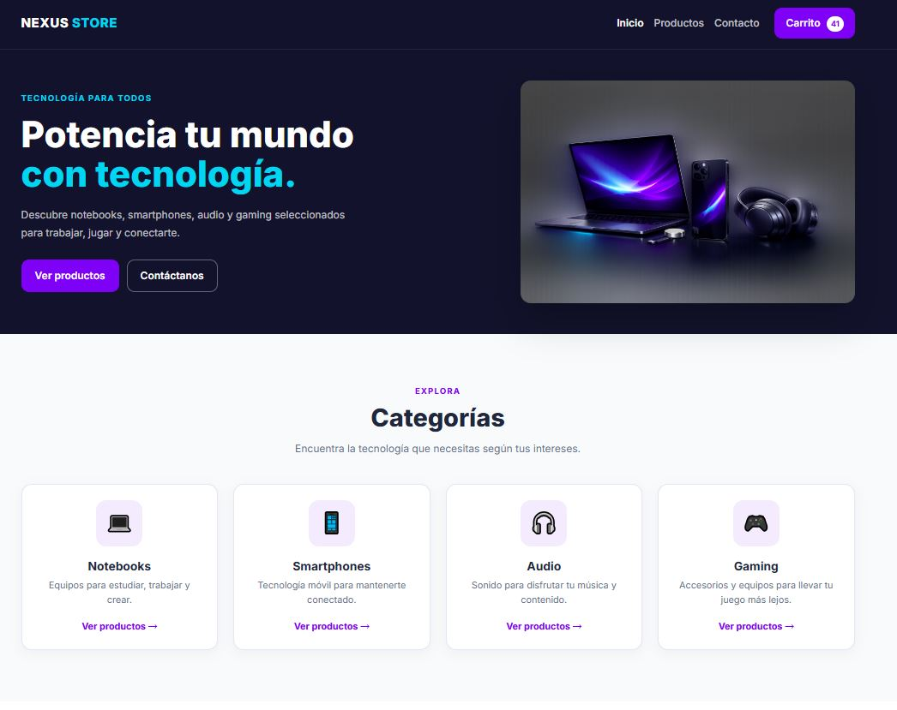
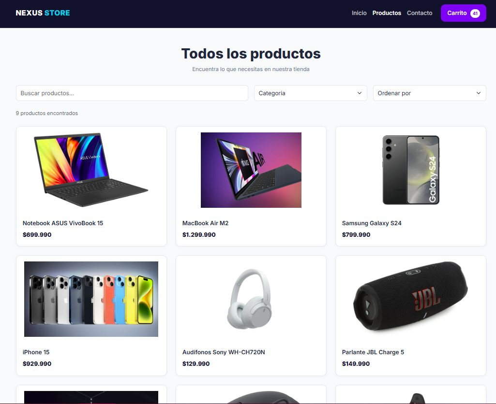
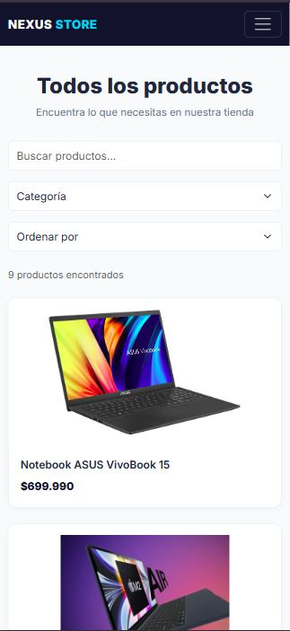
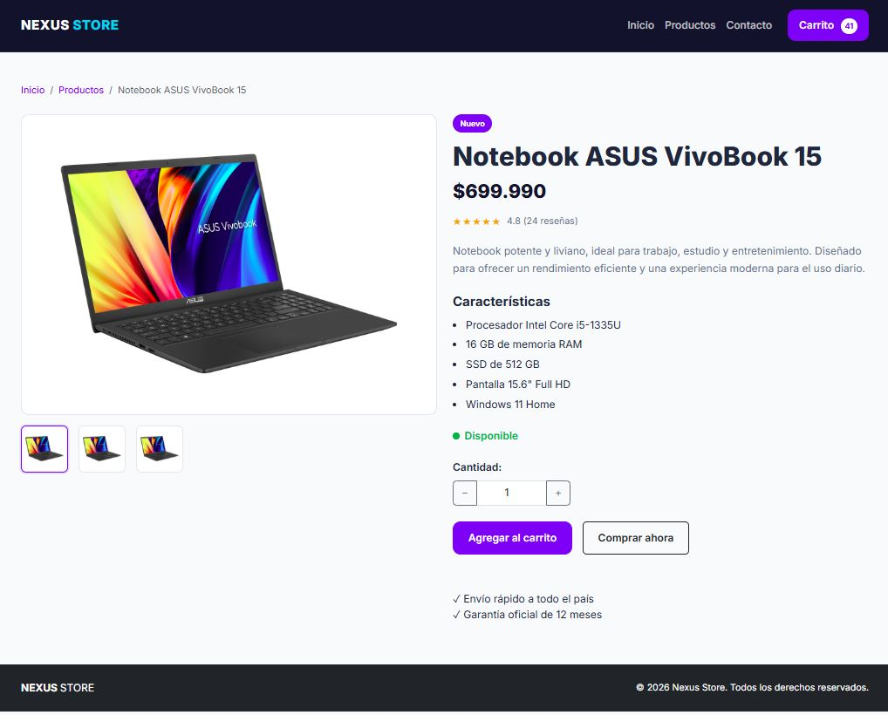
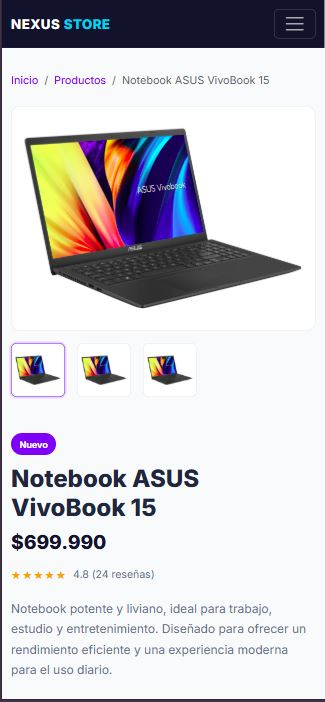
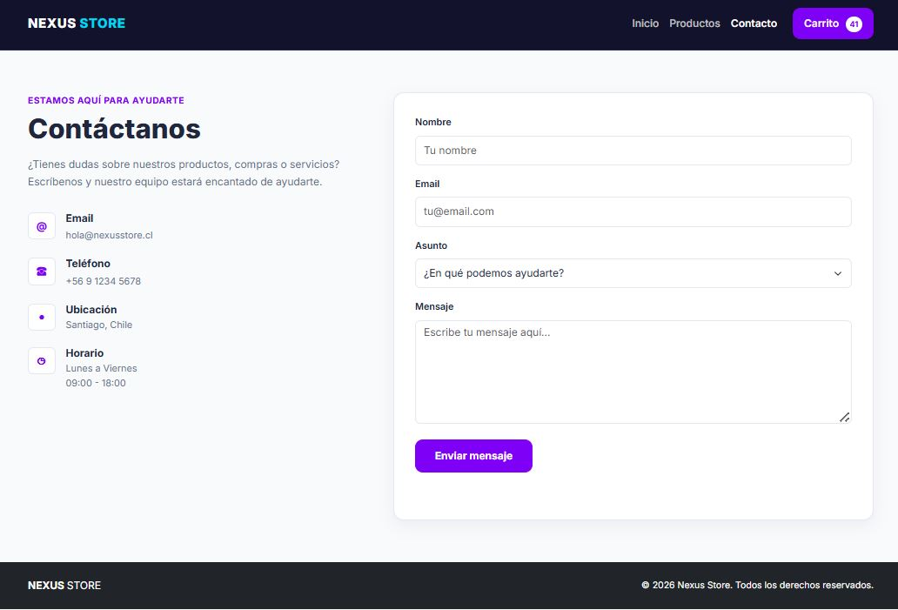
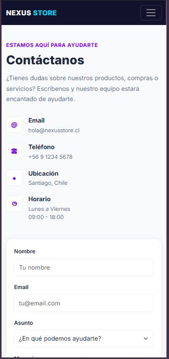

# 💻 Nexus Store — Evaluación 1

Proyecto grupal correspondiente a la **Evaluación 1 del Diplomado Full Stack**.

**Nexus Store** es un mini catálogo web de productos tecnológicos desarrollado como **Opción B — Mini-catálogo**, utilizando **HTML5, CSS3, Bootstrap 5, JavaScript Vanilla y Git/GitHub**.

El proyecto aplica diseño responsive, estructura semántica, accesibilidad, manipulación del DOM, navegación dinámica entre productos y categorías, persistencia mediante `localStorage` y un flujo de trabajo colaborativo basado en ramas, Pull Requests y Code Review.

---

## 🌐 Demo en vivo

Nexus Store se encuentra desplegado mediante GitHub Pages:

https://ogrodrigo.github.io/Evaluacion_1/

---

## 🔗 Repositorio

Repositorio oficial del proyecto:

https://github.com/OGRodrigo/Evaluacion_1

---

## 👥 Integrantes

- Rodrigo Astudillo
- Waldo Araya

---

## 🎯 Objetivo del proyecto

Desarrollar un mini sitio web responsive de productos tecnológicos que permita aplicar los principales contenidos trabajados durante el módulo:

- HTML5 semántico.
- CSS3.
- Bootstrap 5.
- Responsive Design y enfoque Mobile First.
- JavaScript Vanilla.
- Manipulación del DOM.
- Eventos con `addEventListener`.
- Parámetros de URL mediante `URLSearchParams`.
- Persistencia con `localStorage`.
- Git y GitHub.
- Trabajo colaborativo mediante ramas, Pull Requests y Code Review.

---

## 🛠️ Tecnologías utilizadas

| Tecnología | Uso |
|---|---|
| HTML5 | Estructura semántica de las páginas |
| CSS3 | Estilos personalizados e identidad visual |
| Bootstrap 5 | Grid, componentes y responsive |
| JavaScript Vanilla | Interactividad, eventos y manipulación del DOM |
| URLSearchParams | Lectura de productos y categorías desde la URL |
| localStorage | Persistencia del contador del carrito |
| Git | Control de versiones |
| GitHub | Repositorio, ramas, Pull Requests y Code Review |
| GitHub Pages | Despliegue público del proyecto |
| Visual Studio Code | Entorno de desarrollo |
| Live Server | Ejecución local del proyecto |

---

## 📁 Estructura del proyecto

```text
Evaluacion_1/
│
├── .github/
│   └── pull_request_template.md
│
├── css/
│   └── custom.css
│
├── docs/
│   └── screenshots/
│       ├── home.JPG
│       ├── productos.JPG
│       ├── productos-mobile.JPG
│       ├── producto.JPG
│       ├── producto-mobile.JPG
│       ├── contacto.JPG
│       └── contacto-mobile.JPG
│
├── img/
│   ├── Image_Hero.jpg
│   ├── asus-vivobook.jpg
│   ├── corsair-tc100.jpg
│   ├── iphone-15.jpg
│   ├── jbl-charge-5.jpg
│   ├── logitech-g913.jpg
│   ├── logitech-mx-master-3s.jpg
│   ├── macbook-air-m2.jpg
│   ├── samsung-galaxy-s24.jpg
│   └── sony-wh-ch720n.jpg
│
├── js/
│   ├── main.js
│   └── product_detail.js
│
├── index.html
├── productos.html
├── producto.html
├── contacto.html
├── .gitignore
└── README.md
```

---

## 🌐 Páginas del sitio

### 🏠 Inicio — `index.html`

Página principal de Nexus Store.

Incluye:

- Navbar responsive.
- Hero principal.
- Llamadas a la acción.
- Categorías de productos.
- Productos destacados.
- Beneficios.
- CTA.
- Footer.

Las categorías permiten navegar hacia el catálogo indicando la categoría seleccionada mediante un parámetro en la URL.

Ejemplo:

```text
productos.html?categoria=notebooks
```

Los productos destacados permiten acceder directamente al detalle correspondiente mediante un identificador.

Ejemplo:

```text
producto.html?id=samsung-galaxy-s24
```

---

### 🛒 Productos — `productos.html`

Catálogo general de productos tecnológicos.

Incluye:

- Buscador dinámico de productos.
- Filtro por categoría.
- Selector de ordenamiento.
- Contador dinámico de resultados.
- Grid responsive.
- Cards de productos.
- Imágenes locales.
- Paginación visual.
- Navegación hacia el detalle dinámico de cada producto.
- Recepción automática de categorías desde el Home.

Distribución responsive:

```text
Mobile   → 1 producto por fila
Tablet   → 2 productos por fila
Desktop  → 3 productos por fila
```

Las cards contienen atributos `data-*` que permiten trabajar con JavaScript.

Ejemplo:

```html
data-name="Notebook ASUS VivoBook 15"
data-category="notebooks"
data-price="699990"
```

La paginación incluida en la interfaz es solamente visual y no implementa cambio real de páginas.

---

### 💻 Detalle de producto — `producto.html`

Página utilizada para mostrar dinámicamente la información del producto seleccionado.

Incluye:

- Breadcrumb.
- Imagen principal.
- Galería de miniaturas.
- Nombre.
- Precio.
- Valoración.
- Descripción.
- Características técnicas.
- Disponibilidad.
- Selector de cantidad.
- Botón **Agregar al carrito**.
- Botón **Comprar ahora**.
- Información de envío y garantía.

El producto se identifica mediante el parámetro `id` recibido desde la URL.

Ejemplo:

```text
producto.html?id=asus-vivobook
```

El archivo:

```text
js/product_detail.js
```

lee el identificador utilizando `URLSearchParams`, obtiene los datos correspondientes y actualiza dinámicamente el DOM de `producto.html`.

Ejemplos de navegación:

```text
producto.html?id=asus-vivobook
producto.html?id=macbook-air-m2
producto.html?id=samsung-galaxy-s24
producto.html?id=iphone-15
producto.html?id=sony-wh-ch720n
producto.html?id=jbl-charge-5
producto.html?id=logitech-g913
producto.html?id=logitech-mx-master-3s
producto.html?id=corsair-tc100
```

De esta manera, una única página `producto.html` permite mostrar dinámicamente los nueve productos disponibles en el catálogo.

Si el identificador recibido no corresponde a un producto registrado, la implementación utiliza ASUS VivoBook como producto de respaldo.

El diseño fue desarrollado siguiendo un enfoque **Mobile First**.

---

### ✉️ Contacto — `contacto.html`

Página destinada a consultas de los usuarios.

Incluye:

- Información de contacto.
- Email.
- Teléfono.
- Ubicación.
- Horario de atención.
- Formulario de contacto.
- Nombre.
- Email.
- Asunto.
- Mensaje.
- Validaciones HTML5.
- Footer compartido.

El formulario utiliza atributos como:

```html
required
type="email"
minlength
```

para proporcionar una primera capa de validación nativa.

---

## 📱 Responsive Design

El proyecto fue desarrollado con enfoque **Mobile First**, utilizando Bootstrap Grid y Media Queries.

Se realizaron pruebas principalmente en:

```text
Mobile:   375px
Tablet:   768px
Desktop:  1200px
```

Se utiliza el sistema de columnas de Bootstrap mediante clases como:

```html
col-12
col-md-6
col-lg-3
col-lg-4
col-lg-6
```

De esta forma, el contenido se reorganiza de acuerdo con el ancho disponible de la pantalla.

También se verificó que las páginas responsive no produzcan overflow horizontal.

Ejemplo de comprobación utilizada durante las pruebas:

```javascript
document.documentElement.scrollWidth ===
document.documentElement.clientWidth
```

Resultado esperado:

```text
true
```

---

## ⚡ JavaScript

El proyecto utiliza **JavaScript Vanilla** para agregar comportamiento dinámico a la interfaz.

La lógica se encuentra separada principalmente en:

```text
js/main.js
js/product_detail.js
```

### `main.js`

Contiene las funcionalidades generales del sitio:

- Carrito.
- Selector de cantidad.
- Persistencia con `localStorage`.
- Buscador de productos.
- Filtro por categoría.
- Ordenamiento.
- Contador de resultados.
- Lectura de categorías desde la URL.

### `product_detail.js`

Contiene la lógica específica del detalle dinámico:

- Datos de los nueve productos del catálogo.
- Lectura del parámetro `id`.
- Selección del producto correspondiente.
- Modificación dinámica del DOM.
- Actualización del título de la pestaña.
- Actualización del breadcrumb.
- Actualización de imagen principal y miniaturas.
- Actualización del badge.
- Actualización del nombre.
- Actualización del precio.
- Actualización de la valoración y cantidad de reseñas.
- Actualización de la descripción.
- Actualización de las características técnicas.

De esta forma se reutiliza una única página `producto.html` para mostrar el detalle de los nueve productos disponibles en el catálogo.

---

## 🛒 Carrito

La funcionalidad del carrito contempla:

- Aumentar cantidad.
- Disminuir cantidad.
- Validar límites mínimos y máximos.
- Limitar la selección a un máximo de 10 unidades por operación.
- Agregar unidades al carrito.
- Actualizar el contador visible.
- Mostrar feedback al usuario.
- Persistir la cantidad mediante `localStorage`.

El carrito implementado corresponde a una funcionalidad demostrativa basada en cantidad total y no a un sistema de ecommerce con backend.

Ejemplo de evento propio:

```javascript
addToCartButton.addEventListener(
    "click",
    addProductToCart
);
```

El evento produce cambios visibles en el DOM mediante el contador y el mensaje mostrado al usuario.

---

## 🔎 Catálogo dinámico

El catálogo incorpora funcionalidades desarrolladas con JavaScript Vanilla.

### Búsqueda

Permite buscar productos mediante el evento:

```javascript
productSearch.addEventListener(
    "input",
    filterProducts
);
```

La búsqueda contempla:

- Nombre del producto.
- Categoría.
- Conversión a minúsculas.
- Normalización de texto.
- Búsqueda con o sin tildes.

---

### Filtro por categoría

Permite mostrar únicamente los productos pertenecientes a una categoría.

Categorías disponibles:

```text
Notebooks
Smartphones
Audio
Gaming
Accesorios
```

También puede recibir la categoría directamente desde el Home.

Ejemplo:

```text
productos.html?categoria=gaming
```

JavaScript lee el parámetro:

```javascript
const categoryFromUrl =
    urlParameters.get("categoria");
```

y selecciona automáticamente la opción correspondiente antes de ejecutar el filtro.

Ejemplos:

```text
productos.html?categoria=notebooks
productos.html?categoria=smartphones
productos.html?categoria=audio
productos.html?categoria=gaming
```

---

### Ordenamiento

El catálogo permite ordenar los productos por:

```text
Menor precio
Mayor precio
Nombre A-Z
```

El ordenamiento utiliza los valores almacenados en los atributos:

```html
data-price
data-name
```

---

### Contador de resultados

Cada búsqueda o filtrado actualiza dinámicamente:

```html
id="products-counter"
```

Ejemplo:

```text
2 productos encontrados
```

Esto representa una modificación visible del DOM.

---

## 🔗 Navegación dinámica

Nexus Store utiliza parámetros de URL para conectar las distintas vistas del sitio.

### Navegación por categoría

Desde el Home:

```text
Home
↓
Categoría Notebooks
↓
productos.html?categoria=notebooks
↓
main.js
↓
Filtro automático
↓
Solo productos de Notebooks
```

### Navegación por producto

Desde el Home o catálogo:

```text
Producto Samsung Galaxy S24
↓
producto.html?id=samsung-galaxy-s24
↓
product_detail.js
↓
Lectura del id
↓
Actualización del DOM
↓
Detalle del Samsung Galaxy S24
```

Esta implementación permite reutilizar una única página `producto.html` para mostrar diferentes productos.

---

## 🧩 Manipulación del DOM

El proyecto utiliza JavaScript para modificar elementos visibles de la página.

Algunos ejemplos son:

- Actualización del contador del carrito.
- Mensajes al agregar productos.
- Mostrar y ocultar cards del catálogo.
- Contador de productos encontrados.
- Actualización dinámica del detalle de producto.
- Selección automática de categorías.

Se utilizan métodos y propiedades como:

```javascript
document.querySelector()
document.querySelectorAll()
textContent
setAttribute()
classList.toggle()
appendChild()
dataset
```

---

## 🎧 Eventos propios

El proyecto contiene múltiples eventos creados mediante `addEventListener`.

Entre ellos:

```text
click  → disminuir cantidad
click  → aumentar cantidad
click  → agregar al carrito
input  → buscar productos
change → filtrar categoría
change → ordenar productos
```

Estos eventos pertenecen al código JavaScript propio del proyecto y producen cambios visibles en el DOM.

Las interacciones automáticas de Bootstrap mediante atributos `data-bs-*` no se consideran parte de estos eventos propios.

---

## 💾 Persistencia con localStorage

El contador del carrito utiliza:

```javascript
localStorage.setItem()
localStorage.getItem()
```

Esto permite conservar la cantidad almacenada aunque el usuario recargue la página o navegue entre distintas páginas del sitio.

La clave utilizada por el proyecto es:

```text
nexusCartQuantity
```

---

## ♿ Accesibilidad

Durante el desarrollo se incorporaron prácticas de accesibilidad:

- HTML semántico.
- Atributos `alt` en imágenes informativas.
- `alt=""` en imágenes decorativas cuando corresponde.
- `label` asociados a formularios.
- `aria-label`.
- `aria-current`.
- `aria-live`.
- `role="status"` para información dinámica cuando corresponde.
- `role="img"` para representar visualmente la valoración del producto.
- Uso de botones reales para acciones.
- Estados `focus`.
- Contraste visual.
- Jerarquía adecuada de títulos.
- Correcciones detectadas mediante validación W3C.

---

## ✅ Validación W3C

Las cuatro páginas principales de Nexus Store fueron verificadas utilizando **W3C Nu HTML Checker**, con el objetivo de comprobar la estructura y conformidad del marcado HTML5.

Durante el cierre del proyecto se validaron las cuatro páginas principales, registrando 0 errores y 0 advertencias.

| Página | Errores | Advertencias | Estado |
|---|---:|---:|---|
| `index.html` | 0 | 0 | ✅ Válido |
| `productos.html` | 0 | 0 | ✅ Válido |
| `producto.html` | 0 | 0 | ✅ Válido |
| `contacto.html` | 0 | 0 | ✅ Válido |

**Herramienta utilizada:** W3C Nu HTML Checker

Resultado final:

```text
index.html       → 0 errores / 0 advertencias
productos.html   → 0 errores / 0 advertencias
producto.html    → 0 errores / 0 advertencias
contacto.html    → 0 errores / 0 advertencias
```

---

## 🎨 Identidad visual

Nexus Store utiliza una identidad visual moderna orientada a productos tecnológicos.

### Paleta principal

```text
Primario:         #6366F1
Primario Hover:   #4F46E5
Secundario:       #22D3EE
Oscuro:           #0F172A
Oscuro suave:     #1E293B
Texto:            #1E293B
Texto secundario: #64748B
Fondo:            #F8FAFC
Superficie:       #FFFFFF
Borde:            #E2E8F0
```

### Tipografía principal

**Inter**

La tipografía se carga mediante Google Fonts.

---

## 🅱️ Bootstrap

Bootstrap 5 se incorpora mediante CDN.

El CSS propio:

```text
css/custom.css
```

se carga después de Bootstrap para permitir personalizar la apariencia visual del sitio.

Entre los elementos y utilidades de Bootstrap utilizados se encuentran:

- Navbar.
- Collapse del menú mobile.
- Grid.
- Cards.
- Formularios.
- Input Group.
- Breadcrumb.
- Pagination visual.
- Botones.
- Utilidades responsive.
- Flexbox utilities.
- Espaciados.

Los componentes se complementan con CSS personalizado para mantener una identidad visual propia.

---

## 🌿 Flujo de trabajo Git

El proyecto utiliza un flujo basado en ramas por funcionalidad.

Ejemplos de ramas utilizadas durante el desarrollo:

```text
main
│
├── feature/estructura-inicial
├── feature/navbar
├── feature/hero
├── feature/home-secciones
├── feature/listado-productos
├── feature/detalle-producto
├── feature/contacto
├── feature/carrito-js
├── feature/busqueda-js
├── feature/navbar-w3c
├── feature/producto-w3c
├── feature/documentacion-readme
├── feature/detalle-dinamico
├── feature/correccion-integracion-detalle
├── docs/readme-final
└── feature/actualizar-readme-final
```

Flujo utilizado:

```text
main actualizado
      ↓
crear rama de trabajo
      ↓
desarrollo
      ↓
pruebas locales
      ↓
commits descriptivos
      ↓
push
      ↓
Pull Request
      ↓
Code Review del compañero
      ↓
correcciones si corresponden
      ↓
nueva revisión
      ↓
Approve
      ↓
Merge a main
      ↓
actualizar main local
```

---

## 🔍 Code Review

Los Pull Requests son revisados por el otro integrante antes de realizar el merge.

Durante las revisiones se consideran aspectos como:

- Estructura HTML.
- Separación de responsabilidades.
- Responsive.
- Consistencia visual.
- Accesibilidad.
- Comportamiento JavaScript.
- Navegación entre páginas.
- Posibles errores.
- Casos límite.
- Integración con código existente.

Cuando se detecta una observación se utiliza **Request changes**.

El desarrollador realiza la corrección en la misma rama y posteriormente se ejecuta una nueva revisión antes del merge.

Este flujo permitió detectar y corregir durante el proyecto problemas relacionados con:

- Bootstrap JavaScript.
- CSS.
- Validaciones del carrito.
- Accesibilidad.
- Navegación dinámica.
- Integración entre Home, catálogo y detalle.
- Documentación final.

---

## 📝 Convención de commits

Se utilizan mensajes descriptivos siguiendo **Conventional Commits**.

Ejemplos:

```text
feat: agregar estructura del detalle de producto
style: aplicar diseño responsive al detalle de producto
fix: unificar footer y beneficios del detalle
chore: agregar imagenes del catalogo
docs: ampliar documentacion del proyecto
fix: corregir navegacion de productos y categorias
docs: actualizar README final del proyecto
```

Prefijos utilizados:

```text
feat:     nueva funcionalidad
style:    cambios visuales
fix:      corrección
chore:    tareas auxiliares
docs:     documentación
refactor: reorganización sin cambio funcional
```

---

## ▶️ Cómo ejecutar el proyecto

### 1. Clonar el repositorio

```bash
git clone https://github.com/OGRodrigo/Evaluacion_1.git
```

### 2. Entrar al proyecto

```bash
cd Evaluacion_1
```

### 3. Abrir con Visual Studio Code

```bash
code .
```

### 4. Ejecutar con Live Server

Abrir:

```text
index.html
```

y seleccionar:

```text
Open with Live Server
```

También es posible abrir directamente:

```text
index.html
productos.html
producto.html
contacto.html
```

Para comprobar correctamente la navegación mediante parámetros de URL se recomienda ejecutar el proyecto utilizando Live Server.

---

## 🧪 Pruebas realizadas

Durante el desarrollo se realizaron pruebas manuales sobre:

- Navegación entre páginas.
- Navbar responsive.
- Menú mobile.
- Hero.
- Categorías del Home.
- Productos destacados.
- Grid de productos.
- Imágenes.
- Adaptación responsive.
- Formularios.
- Validaciones HTML5.
- Controles de cantidad.
- Límite máximo de 10 unidades por operación.
- Contador del carrito.
- Persistencia mediante `localStorage`.
- Búsqueda de productos.
- Búsqueda con y sin tildes.
- Filtro manual por categoría.
- Filtro de categorías recibido desde el Home.
- Ordenamiento por precio.
- Ordenamiento alfabético.
- Actualización dinámica del contador de resultados.
- Combinación de búsqueda, filtros y ordenamiento.
- Navegación mediante `?categoria=`.
- Navegación mediante `?id=`.
- Detalle dinámico de productos.
- Navegación desde productos destacados.
- Navegación desde las cards del catálogo.
- Comportamiento entre páginas.
- Ausencia de overflow horizontal.
- Validación W3C de las cuatro páginas principales.

---

## 📸 Capturas del proyecto

Las siguientes capturas muestran la interfaz de Nexus Store tanto en escritorio como en dispositivos móviles, permitiendo visualizar la adaptación responsive del proyecto.

### 🏠 Home

#### Desktop



El Home presenta la navegación principal, el Hero, las categorías, los productos destacados, los beneficios y las llamadas a la acción del sitio.

---

### 📦 Catálogo de productos

#### Desktop



#### Mobile



En dispositivos móviles, los controles de búsqueda, categoría y ordenamiento se organizan verticalmente y las cards de productos se adaptan al ancho disponible.

---

### 🔍 Detalle de producto

#### Desktop



#### Mobile



La vista de detalle cambia desde una distribución horizontal en escritorio a una distribución vertical en dispositivos móviles.

El contenido de la página se actualiza dinámicamente según el producto seleccionado.

---

### ✉️ Contacto

#### Desktop



#### Mobile



La información de contacto y el formulario se reorganizan para mantener una correcta visualización y experiencia de usuario en pantallas pequeñas.

---

## ✅ Estado del proyecto

Nexus Store se encuentra **finalizado para la Evaluación 1 del Diplomado Full Stack**.

Las cuatro páginas requeridas se encuentran implementadas:

```text
Home
Listado de productos
Detalle de producto
Contacto
```

El proyecto cuenta con:

- HTML5 semántico.
- CSS3 personalizado.
- Bootstrap 5 mediante CDN.
- Diseño Mobile First.
- Layout responsive para mobile y desktop.
- JavaScript Vanilla.
- Manipulación del DOM.
- Eventos propios mediante `addEventListener`.
- Búsqueda, filtros y ordenamiento del catálogo.
- Navegación dinámica por categorías.
- Detalle dinámico de productos.
- Carrito básico con persistencia mediante `localStorage`.
- Validación W3C de las cuatro páginas con 0 errores y 0 advertencias.
- Flujo colaborativo mediante ramas, Pull Requests y Code Review.
- Conventional Commits.
- Capturas responsive del proyecto.
- Despliegue mediante GitHub Pages.

El proyecto queda preparado para su presentación y defensa correspondiente a la **Evaluación 1**.

---

## 📌 Alcance actual

Nexus Store corresponde a un proyecto Front End académico.

Actualmente implementa:

```text
HTML + CSS + Bootstrap + JavaScript Vanilla
```

No utiliza:

```text
Backend
Base de datos
API externa
Sistema real de pagos
Autenticación
Carrito ecommerce completo
```

Estas funcionalidades quedan fuera del alcance de la Evaluación 1 y pueden incorporarse en futuras etapas del proyecto.

---

## 👥 Trabajo colaborativo

El desarrollo se realizó de forma colaborativa utilizando GitHub.

Cada integrante:

- Desarrolló funcionalidades en ramas independientes.
- Realizó commits propios.
- Creó Pull Requests.
- Revisó el código del compañero.
- Solicitó correcciones cuando correspondió.
- Corrigió observaciones dentro de la misma rama.
- Aprobó los cambios antes del merge.
- Participó en la documentación final del proyecto.

Este flujo permitió mantener `main` estable y documentar claramente la participación de ambos integrantes.

---

## 📄 Evaluación

Proyecto desarrollado para:

**Diplomado Full Stack — Evaluación 1**

Modalidad:

**Proyecto grupal**

Tipo de proyecto:

**Opción B — Mini-catálogo**

Tecnologías principales:

**HTML5 · CSS3 · Bootstrap 5 · JavaScript Vanilla · Git · GitHub**

---

## 👨‍💻 Autores

- Rodrigo Astudillo
- Waldo Araya

Proyecto académico desarrollado con fines educativos.